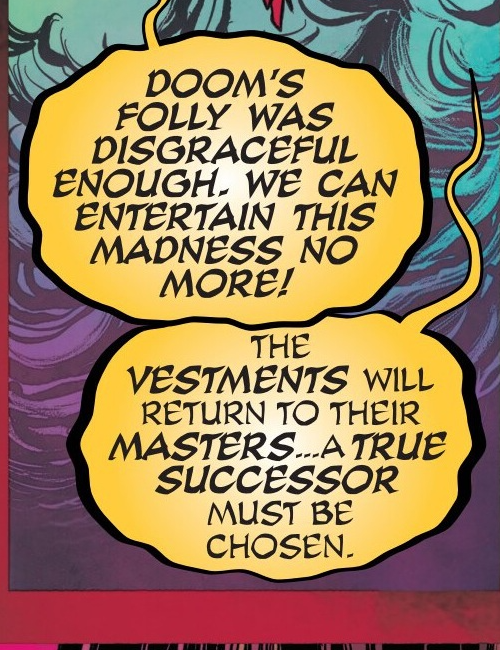
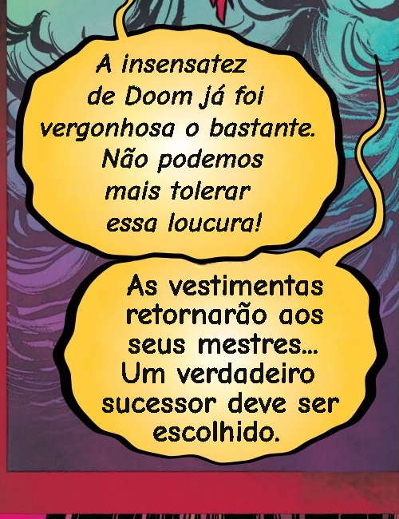
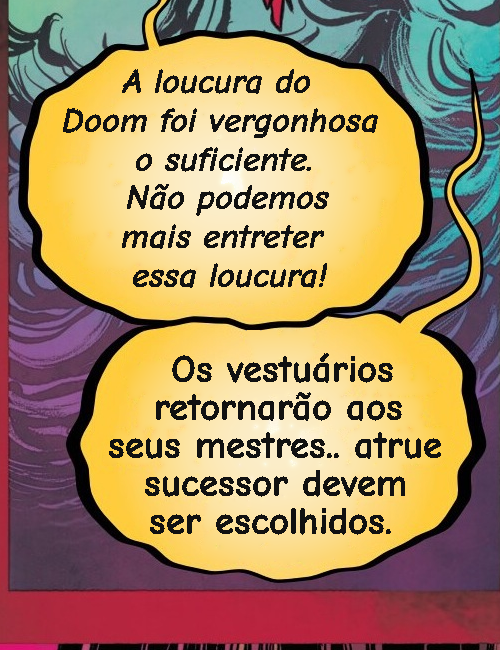
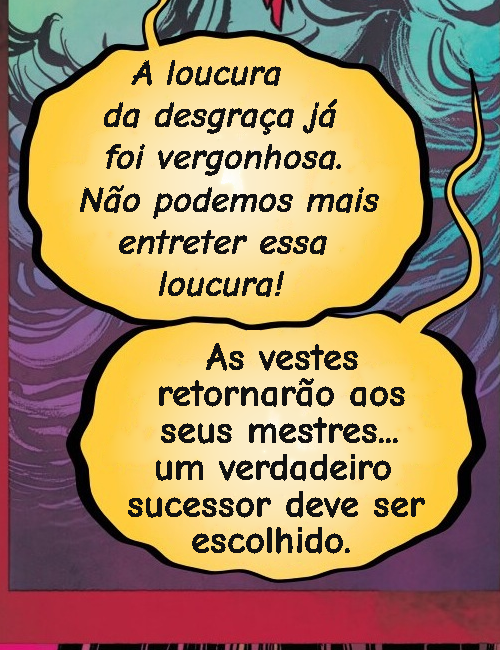
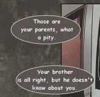
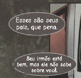
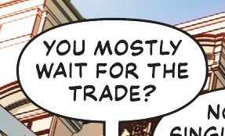
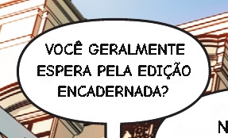

# Exemplos: antes e depois

[Voltar ao README](README.md)

Recortes de resultados reais salvos durante o desenvolvimento. Clique nas imagens para ampliar. Os exemplos ilustram essas amostras; não representam garantia de qualidade para todos os quadrinhos.

## Limpeza e desenho do texto

Mesmo recorte da página 20 de *Sorcerer Supreme*, com duas falas amarelas adjacentes. Todas as variantes desta seção usam **as mesmas traduções de referência em português**, preparadas para avaliar limpeza e encaixe, sem chamada de tradutor. Canvas e SVG são modos de desenho; leve, IA e híbrido são modos de limpeza e podem ser combinados.

| Opção | Antes | Depois |
|---|---|---|
| **Leve + Canvas**: limpeza sem modelo adicional e texto rasterizado |  |  |
| **Leve + SVG**: mesma limpeza e texto vetorial |  |  |
| **IA + SVG**: LaMa em todos os balões selecionados no teste |  |  |
| **Híbrido + SVG**: leve nos uniformes e LaMa nos difíceis |  |  |

Neste recorte, os dois balões amarelos têm gradiente e vão para LaMa no híbrido. A economia de trabalho aparece nos balões uniformes da mesma página, que ficam com a limpeza leve. As imagens Canvas/SVG são capturas PNG para exibição no GitHub; a captura do SVG não conserva o zoom vetorial do leitor.

Detalhes: [AI-INPAINT.md](AI-INPAINT.md), [SVG-READER.md](SVG-READER.md).

## Tradutores

Traduções obtidas em execuções anteriores, desenhadas para esta galeria com o renderizador SVG e limpeza leve atuais. Nenhuma nova chamada a API ou inferência de tradução foi feita para produzir estes exemplos.

### OPUS-MT local

Os dois modelos usam o mesmo recorte e normalização de maiúsculas. São exemplos da configuração normalizada; não demonstram o resultado com normalização desligada.

| Modelo | Antes | Depois |
|---|---|---|
| **Compacto (~122 MB)** |  |  |
| **Maior (~519 MB)** |  |  |

Observe o erro de contexto/nome próprio: **Doom** pode virar **desgraça**. A galeria conserva a tradução registrada, sem correção manual para melhorar a apresentação. Veja [OPUS-MT-TEST.md](OPUS-MT-TEST.md).

### Google sem chave

Recorte de *Batman*, página 5 da amostra Bbato, de baixa resolução. Mostra uma resposta salva do Google experimental; a disponibilidade do serviço pode variar.

| Antes | Depois: Google + leve + SVG |
|---|---|
|  |  |

### Gemini

Recorte da imagem de teste `7.jpg`, com tradução salva de uma chamada real ao Gemini. O modelo usado está registrado no [manifesto da galeria](docs/examples/provenance.json); outros modelos podem produzir respostas diferentes.

| Antes | Depois: Gemini + leve + SVG |
|---|---|
|  |  |

### MyMemory

**Exemplo visual pendente.** Nas amostras investigadas houve respostas parciais e falhas. Não há um antes/depois completo validado salvo para publicar como resultado dessa opção. O leitor mantém MyMemory disponível e recusa traduções identificadas como incompletas.

## Opções de processamento

WASM e WebGPU selecionam o provedor de execução do OCR; não são estilos visuais distintos. Estas imagens não comparam sua fidelidade ou velocidade. As medições e limitações estão em [GPU-PERFORMANCE.md](GPU-PERFORMANCE.md) e [OCR-FIDELITY.md](OCR-FIDELITY.md). O processamento antecipado e o cache também não mudam a aparência do resultado.

## Origem e reprodução

Apenas pequenos recortes para demonstração técnica acompanham o repositório. As obras e suas ilustrações pertencem aos respectivos titulares; não estão abrangidas pela licença do código. Não incluímos páginas completas ou a biblioteca do servidor.

[provenance.json](docs/examples/provenance.json) identifica arquivos de origem e coordenadas de cada recorte. `tools/capture-readme-examples.cjs` gera capturas usando os resultados locais existentes, Edge e Playwright. Para reproduzir, são necessários os artefatos locais ignorados em `ocr-runs/`, a imagem `../imagensinputteste/7.jpg`, os recursos do leitor e o servidor de protótipo na porta 3010.
